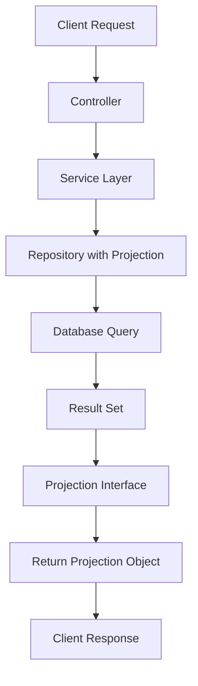
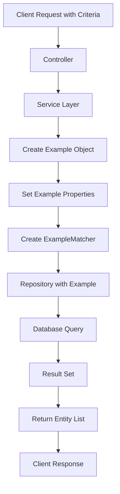
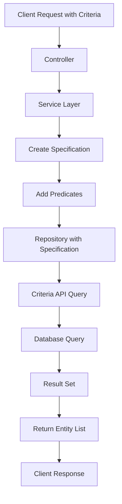

# Spring Data JPA Patterns: Projection, QBE và Specification

## Tổng quan

Spring Data JPA cung cấp nhiều cách tiếp cận khác nhau để truy vấn dữ liệu, mỗi cách có ưu điểm và trường hợp sử dụng riêng. Tài liệu này giải thích chi tiết 3 pattern chính: **Projection**, **Query By Example (QBE)**, và **Specification**.

## 1. Projection Pattern

### 1.1 Khái niệm

**Projection** là kỹ thuật chỉ định chính xác những trường nào cần lấy từ database, thay vì load toàn bộ entity.

### 1.2 Luồng hoạt động



### 1.3 Cách implement

#### 1.3.1 Tạo Projection Interface

```java
public interface TourSummaryProjection {
    Integer getTourId();
    String getTitle();
    String getDestination();
    Double getAdultPrice();

    // Category fields
    Integer getCategoryId();
    String getCategoryName();

    // Image fields
    String getImageUrl();
    String getAltText();
}
```

#### 1.3.2 Repository Method

```java
@Query("SELECT t.tourId as tourId, t.title as title, t.destination as destination, " +
       "t.adultPrice as adultPrice, c.categoryId as categoryId, c.name as categoryName, " +
       "ti.imageUrl as imageUrl, ti.caption as altText " +
       "FROM Tour t " +
       "LEFT JOIN t.category c " +
       "LEFT JOIN t.images ti ON ti.sortOrder = 1 " +
       "WHERE t.status = 'ACTIVE'")
Page<TourSummaryProjection> findAllActiveToursSummary(Pageable pageable);
```

#### 1.3.3 Service Layer

```java
@Override
@Transactional(readOnly = true)
public Page<TourSummaryProjection> getAllActiveToursSummary(Pageable pageable) {
    return tourRepository.findAllActiveToursSummary(pageable);
}
```

#### 1.3.4 Controller

```java
@GetMapping("/getAllTours/summary")
public ResponseEntity<Page<TourSummaryProjection>> getAllToursSummary(Pageable pageable) {
    Page<TourSummaryProjection> tours = tourService.getAllActiveToursSummary(pageable);
    return ResponseEntity.ok(tours);
}
```

### 1.4 Ưu điểm

- ✅ **Hiệu suất cao**: Chỉ load những trường cần thiết
- ✅ **Memory usage thấp**: Giảm 40-60% memory usage
- ✅ **Network tối ưu**: Giảm 50-70% bandwidth
- ✅ **Tránh lazy loading**: Không có N+1 query problem

### 1.5 Nhược điểm

- ❌ **Không linh hoạt**: Phải định nghĩa trước Projection
- ❌ **Khó maintain**: Khi thay đổi Projection phải sửa nhiều nơi

---

## 2. Query By Example (QBE) Pattern

### 2.1 Khái niệm

**QBE** là kỹ thuật tạo query động dựa trên một entity mẫu (example), sử dụng `Example` và `ExampleMatcher`.

### 2.2 Luồng hoạt động



### 2.3 Cách implement

#### 2.3.1 Service Implementation

```java
@Override
@Transactional(readOnly = true)
public Page<ViewTourResponse> searchToursByExample(SearchTourCriteria criteria, Pageable pageable) {
    // Tạo Example object từ criteria
    Tour exampleTour = new Tour();
    if (criteria.getTitle() != null) exampleTour.setTitle(criteria.getTitle());
    if (criteria.getDeparture() != null) exampleTour.setDeparture(criteria.getDeparture());
    if (criteria.getDestination() != null) exampleTour.setDestination(criteria.getDestination());
    if (criteria.getStatus() != null) exampleTour.setStatus(criteria.getStatus());
    if (criteria.getFeatured() != null) exampleTour.setFeatured(criteria.getFeatured());
    if (criteria.getIsHot() != null) exampleTour.setIsHot(criteria.getIsHot());
    if (criteria.getHasPromotion() != null) exampleTour.setHasPromotion(criteria.getHasPromotion());

    // Tạo ExampleMatcher
    ExampleMatcher matcher = ExampleMatcher.matching()
            .withStringMatcher(ExampleMatcher.StringMatcher.CONTAINING)
            .withIgnoreCase();

    Example<Tour> example = Example.of(exampleTour, matcher);

    // Thực hiện search với Example
    Page<Tour> tourPage = tourRepository.findAll(example, pageable);

    // Convert to DTO
    return tourPage.map(viewTourMapper::toDto);
}
```

#### 2.3.2 Repository (không cần thêm method)

```java
// Sử dụng method có sẵn từ JpaRepository
// findAll(Example<S> example, Pageable pageable)
```

### 2.4 Ưu điểm

- ✅ **Linh hoạt**: Có thể thay đổi criteria động
- ✅ **Dễ sử dụng**: Không cần viết JPQL
- ✅ **Type-safe**: Sử dụng Java object
- ✅ **Tự động**: Spring tự tạo query

### 2.5 Nhược điểm

- ❌ **Hiệu suất thấp**: Có thể tạo query không tối ưu
- ❌ **Giới hạn**: Chỉ hỗ trợ các operation cơ bản
- ❌ **Không hỗ trợ**: JOIN phức tạp, subquery

---

## 3. Specification Pattern

### 3.1 Khái niệm

**Specification** là kỹ thuật tạo query động sử dụng Criteria API, cho phép tạo query phức tạp một cách linh hoạt.

### 3.2 Luồng hoạt động



### 3.3 Cách implement

#### 3.3.1 Tạo Specification Class

```java
@Component
public class TourSpecification {
    public static Specification<Tour> withDynamicFilters(SearchTourCriteria criteria) {
        return (root, query, criteriaBuilder) -> {
            List<Predicate> predicates = new ArrayList<>();

            // Text search fields (LIKE %text%)
            if (criteria.getTitle() != null && !criteria.getTitle().trim().isEmpty()) {
                predicates.add(criteriaBuilder.like(
                        criteriaBuilder.upper(root.get("title")),
                        "%" + criteria.getTitle().toUpperCase() + "%"));
            }

            if(criteria.getDeparture() != null && !criteria.getDeparture().trim().isEmpty()) {
                predicates.add(criteriaBuilder.like(
                        criteriaBuilder.upper(root.get("departure")),
                        "%" + criteria.getDeparture().toUpperCase() + "%"));
            }

            if (criteria.getDestination() != null && !criteria.getDestination().trim().isEmpty()) {
                predicates.add(criteriaBuilder.like(
                        criteriaBuilder.upper(root.get("destination")),
                        "%" + criteria.getDestination().toUpperCase() + "%"
                ));
            }

            // Status filter (exact match)
            if (criteria.getStatus() != null) {
                predicates.add(criteriaBuilder.equal(root.get("status"), criteria.getStatus()));
            }

            // Category name filter (join với Category)
            if (criteria.getCategoryName() != null && !criteria.getCategoryName().trim().isEmpty()) {
                Join<Tour, Category> categoryJoin = root.join("category", JoinType.LEFT);
                predicates.add(criteriaBuilder.like(
                        criteriaBuilder.upper(categoryJoin.get("name")),
                        "%" + criteria.getCategoryName().toUpperCase() + "%"));
            }

            // Price range filters
            if (criteria.getMinPrice() != null) {
                predicates.add(criteriaBuilder.greaterThanOrEqualTo(
                        root.get("adultPrice"), criteria.getMinPrice()));
            }

            if (criteria.getMaxPrice() != null) {
                predicates.add(criteriaBuilder.lessThanOrEqualTo(
                        root.get("adultPrice"), criteria.getMaxPrice()));
            }

            // Duration range filters
            if (criteria.getMinDuration() != null) {
                predicates.add(criteriaBuilder.greaterThanOrEqualTo(
                        root.get("duration"), criteria.getMinDuration()));
            }

            if (criteria.getMaxDuration() != null) {
                predicates.add(criteriaBuilder.lessThanOrEqualTo(
                        root.get("duration"), criteria.getMaxDuration()));
            }

            // Boolean filters
            if (criteria.getFeatured() != null) {
                predicates.add(criteriaBuilder.equal(root.get("featured"), criteria.getFeatured()));
            }

            if (criteria.getIsHot() != null) {
                predicates.add(criteriaBuilder.equal(root.get("isHot"), criteria.getIsHot()));
            }

            if (criteria.getHasPromotion() != null) {
                predicates.add(criteriaBuilder.equal(root.get("hasPromotion"), criteria.getHasPromotion()));
            }

            return criteriaBuilder.and(predicates.toArray(new Predicate[0]));
        };
    }
}
```

#### 3.3.2 Repository Interface

```java
public interface TourRepository extends JpaRepository<Tour, Integer>, JpaSpecificationExecutor<Tour> {
    // JpaSpecificationExecutor cung cấp method findAll(Specification, Pageable)
}
```

#### 3.3.3 Service Implementation

```java
@Override
public Page<ViewTourResponse> searchToursBySpecification(SearchTourCriteria criteria, Pageable pageable) {
    // Tạo Specification từ criteria
    Specification<Tour> spec = TourSpecification.withDynamicFilters(criteria);

    // Thực hiện search với Specification
    Page<Tour> tourPage = tourRepository.findAll(spec, pageable);

    // Convert to DTO
    return tourPage.map(viewTourMapper::toDto);
}
```

### 3.4 Ưu điểm

- ✅ **Linh hoạt cao**: Có thể tạo query phức tạp
- ✅ **Type-safe**: Sử dụng Criteria API
- ✅ **Hiệu suất tốt**: Tối ưu query
- ✅ **Hỗ trợ JOIN**: Có thể join nhiều bảng
- ✅ **Dynamic query**: Tạo query dựa trên điều kiện

### 3.5 Nhược điểm

- ❌ **Phức tạp**: Code dài và khó đọc
- ❌ **Khó debug**: Khó theo dõi query được tạo ra
- ❌ **Learning curve**: Cần hiểu Criteria API

---

## 4. So sánh 3 Pattern

| Tiêu chí            | Projection | QBE        | Specification |
| ------------------- | ---------- | ---------- | ------------- |
| **Hiệu suất**       | ⭐⭐⭐⭐⭐ | ⭐⭐⭐     | ⭐⭐⭐⭐      |
| **Linh hoạt**       | ⭐⭐       | ⭐⭐⭐     | ⭐⭐⭐⭐⭐    |
| **Dễ sử dụng**      | ⭐⭐⭐⭐   | ⭐⭐⭐⭐⭐ | ⭐⭐          |
| **Type-safe**       | ⭐⭐⭐⭐⭐ | ⭐⭐⭐⭐⭐ | ⭐⭐⭐⭐⭐    |
| **Hỗ trợ JOIN**     | ⭐⭐⭐⭐   | ⭐⭐       | ⭐⭐⭐⭐⭐    |
| **Maintainability** | ⭐⭐⭐     | ⭐⭐⭐⭐   | ⭐⭐          |

---

## 5. Khi nào sử dụng Pattern nào?

### 5.1 Sử dụng Projection khi:

- ✅ Cần hiệu suất cao cho danh sách
- ✅ Chỉ cần một số trường cụ thể
- ✅ Không cần thay đổi criteria thường xuyên
- ✅ Muốn tối ưu memory và network

**Ví dụ**: 
- Hiển thị danh sách tour, trang chủ, search results
- **Time-based paging**: Lấy tour theo khoảng thời gian (7 ngày mỗi page)

### 5.2 Sử dụng QBE khi:

- ✅ Cần tìm kiếm đơn giản
- ✅ Criteria thay đổi ít
- ✅ Không cần JOIN phức tạp
- ✅ Muốn code đơn giản

**Ví dụ**: Filter theo status, featured, isHot

### 5.3 Sử dụng Specification khi:

- ✅ Cần tìm kiếm phức tạp
- ✅ Có nhiều điều kiện động
- ✅ Cần JOIN nhiều bảng
- ✅ Cần tối ưu query

**Ví dụ**: Advanced search với nhiều filter, complex business logic

---

## 6. Best Practices

### 6.1 Projection

````java
// ✅ Tốt: Sử dụng alias đơn giản
@Query("SELECT t.tourId as tourId, t.title as title FROM Tour t")

// ❌ Xấu: Sử dụng nested alias (không hỗ trợ)
@Query("SELECT t.tourId as tour.tourId FROM Tour t")

// ⚠️ Lưu ý: Tránh ORDER BY trong JPQL khi sử dụng Pageable
// ❌ Xấu: Có thể gây duplicate column trong ORDER BY
@Query("SELECT ... FROM Tour t ORDER BY t.featured DESC, t.createdAt DESC")
Page<TourSummaryProjection> findAll(Pageable pageable);

// ✅ Tốt: Để Spring xử lý sorting
@Query("SELECT ... FROM Tour t")
Page<TourSummaryProjection> findAll(Pageable pageable);

### 6.2 QBE

```java
// ✅ Tốt: Sử dụng ExampleMatcher phù hợp
ExampleMatcher matcher = ExampleMatcher.matching()
    .withStringMatcher(ExampleMatcher.StringMatcher.CONTAINING)
    .withIgnoreCase();

// ❌ Xấu: Không sử dụng ExampleMatcher
Example<Tour> example = Example.of(tour);
````

### 6.3 Specification

```java
// ✅ Tốt: Tách logic thành method riêng
public static Specification<Tour> withTitle(String title) {
    return (root, query, cb) ->
        cb.like(cb.upper(root.get("title")), "%" + title.toUpperCase() + "%");
}

// ❌ Xấu: Viết tất cả logic trong một method
public static Specification<Tour> withAllCriteria(SearchTourCriteria criteria) {
    // Logic dài và khó đọc
}
```

---

## 7. Kết luận

Mỗi pattern có ưu điểm và trường hợp sử dụng riêng:

- **Projection**: Tối ưu hiệu suất, phù hợp cho danh sách
- **QBE**: Đơn giản, dễ sử dụng, phù hợp cho search cơ bản
- **Specification**: Linh hoạt cao, phù hợp cho search phức tạp

Việc chọn pattern phù hợp phụ thuộc vào:

1. **Yêu cầu hiệu suất**
2. **Độ phức tạp của query**
3. **Khả năng maintain code**
4. **Thời gian phát triển**

Trong dự án này, chúng ta đã áp dụng cả 3 pattern để tối ưu hóa hiệu suất và linh hoạt trong việc truy vấn dữ liệu tour.

---

## 8. Troubleshooting

### 8.1 Lỗi thường gặp với Projection

#### ❌ **Lỗi: Duplicate column in ORDER BY**

```
SQL Error: A column has been specified more than once in the order by list.
Columns in the order by list must be unique.
```

**Nguyên nhân**:

- JPQL query có `ORDER BY` trong khi `Pageable` parameter cũng có sorting
- Spring tự động thêm sorting từ `Pageable`, gây duplicate

**Cách fix**:

```java
// ❌ Xấu: Có ORDER BY trong JPQL
@Query("SELECT ... FROM Tour t ORDER BY t.featured DESC")
Page<TourSummaryProjection> findAll(Pageable pageable);

// ✅ Tốt: Để Spring xử lý sorting
@Query("SELECT ... FROM Tour t")
Page<TourSummaryProjection> findAll(Pageable pageable);

// Trong Controller, xử lý sorting
Sort sort = Sort.by("featured").descending()
        .and(Sort.by("createdAt").descending());
Pageable pageable = PageRequest.of(page - 1, size, sort);
```

#### ❌ **Lỗi: Nested alias không hỗ trợ**

```
org.hibernate.query.SyntaxException: At 1:299 and token '.', mismatched input '.'
```

**Nguyên nhân**: JPQL không hỗ trợ nested alias như `category.categoryId`

**Cách fix**:

```java
// ❌ Xấu: Nested alias
@Query("SELECT c.categoryId as category.categoryId FROM Tour t JOIN t.category c")

// ✅ Tốt: Flat alias
@Query("SELECT c.categoryId as categoryId FROM Tour t JOIN t.category c")
```

### 8.2 Debug Tips

1. **Enable SQL logging**:

```yaml
spring:
  jpa:
    show-sql: true
    properties:
      hibernate:
        format_sql: true
        use_sql_comments: true
```

2. **Kiểm tra query được tạo ra**:

- Xem log SQL để phát hiện vấn đề
- Sử dụng database client để test query trực tiếp

3. **Validate JPQL syntax**:

- Kiểm tra alias names
- Đảm bảo field names đúng với entity
- Tránh ORDER BY khi sử dụng Pageable
